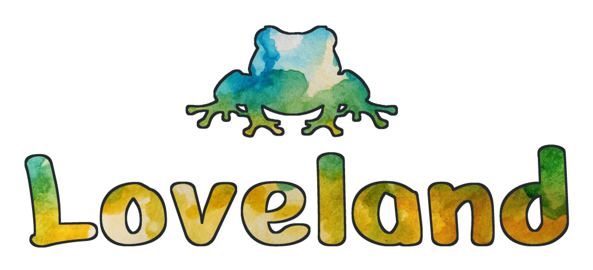

# 

[//]: # (Relink image to Steam page)

[//]: # (TODO: Add Shields badges to Steam, Itch, Trailer)

Loveland is a short platformer video game inspired by the folktales of the Loveland Frog, a cryptid from Ohio. This passion project was produced over a single summer by a small team using [Godot Engine](https://godotengine.org). We invite you to play for free on [Steam](TODO) or [Itch](TODO), as well as learn from, explore, and even modify our open source code.

## About

Loveland was originally produced for [Godot Wild Jam #70](https://itch.io/jam/godot-wild-jam-70). After that initial (very broken) release, we continued working until it was ready to share with the world. This was a big milestone for our team, being our first game to come fully to fruition.

## Installation and Usage

To run the game locally, you will need to install Godot and clone this project.

> [!IMPORTANT]
> This project uses [Godot Engine 4.2 (.NET build)](https://godotengine.org/download/archive/4.2-stable/) and has not been tested on other versions of Godot.

1. Install [Godot 4.2 .NET](https://godotengine.org/download/archive/4.2-stable/).
2. If you do not have any familiarity with Godot, consider reading the [Documentation Introduction](https://docs.godotengine.org/en/stable/about/introduction.html) and [Engine Introduction](https://docs.godotengine.org/en/stable/getting_started/introduction/introduction_to_godot.html) to get familiar with the program.
3. Clone this repository.
4. Run Godot Engine and import this repository.
5. Hit the `Run Project` button to start the game.

## Contributing

We currently welcome contributions in the forms of:

- [Bug reports](https://github.com/JuniperP/Loveland/issues)
- Bug fixes via [pull requests](https://github.com/JuniperP/Loveland/pulls)

> [!NOTE]
> There are no current plans for additional in-game content, but we would love to see any content you make!

## License

Loveland Assets refers to all intellectual property in this repository, excluding Loveland Code.  
Loveland Code refers to all source code, Godot files, and related documentation within this repository.

Loveland Assets © 2024 by Alex Lloyd, Amanda Tozer, Anja Jacobson, Elliot Newhouse, Joe Tozer, Juniper Pasternak, Lee Zwart, Max Tozer, Phoebe Tozer, Theodore (Teddy) Jacobson,  is licensed under [CC BY-NC-SA 4.0](https://creativecommons.org/licenses/by-nc-sa/4.0/).  
Loveland Code © 2024 by Juniper Pasternak and Teddy Jacobson is licensed under [GNU GPLv3](https://www.gnu.org/licenses/gpl-3.0.en.html).

## Credits

Loveland is created and developed by Alcove Devs.

### Programming & Godot Engineers

Juniper Pasternak  
Teddy Jacobson  

### Level Design

Juniper Pasternak  
Teddy Jacobson  

### Music

Elliot Newhouse  
Max Tozer  
Phoebe Tozer  
frogs at summer night by trouby -- https://freesound.org/s/379828/ -- License: Attribution 4.0

### Background Art

Phoebe Tozer  

### UI Art

Juniper Pasternak
Phoebe Tozer  
Teddy Jacobson  
Hand drawn frog silhouette designed by Freepik, www.freepik.com

### Sprite Creation

Lee Zwart  
Phoebe Tozer  

### Story/Script

Alex Lloyd  
Juniper Pasternak  
Lee Zwart  
Phoebe Tozer  
Teddy Jacobson  

### Sound Effect Editors

Juniper Pasternak  
Phoebe Tozer  

### Sound Effect Creators

Alex Lloyd  
Amanda Tozer  
Anja Jacobson  
Joe Tozer  
Max Tozer  
Teddy Jacobson  

### Concept Design

Alex Lloyd  
Clara Siefke  
Juniper Pasternak  
Lee Zwart  
Phoebe Tozer  
Teddy Jacobson  

### Funding

Eric Jacobson

### Godot License

This game uses Godot Engine, available under the following license:

Copyright (c) 2014-present Godot Engine contributors.
Copyright (c) 2007-2014 Juan Linietsky, Ariel Manzur.

Permission is hereby granted, free of charge, to any person obtaining a copy
of this software and associated documentation files (the "Software"), to deal
in the Software without restriction, including without limitation the rights
to use, copy, modify, merge, publish, distribute, sublicense, and/or sell
copies of the Software, and to permit persons to whom the Software is
furnished to do so, subject to the following conditions:

The above copyright notice and this permission notice shall be included in all
copies or substantial portions of the Software.

THE SOFTWARE IS PROVIDED "AS IS", WITHOUT WARRANTY OF ANY KIND, EXPRESS OR
IMPLIED, INCLUDING BUT NOT LIMITED TO THE WARRANTIES OF MERCHANTABILITY,
FITNESS FOR A PARTICULAR PURPOSE AND NONINFRINGEMENT. IN NO EVENT SHALL THE
AUTHORS OR COPYRIGHT HOLDERS BE LIABLE FOR ANY CLAIM, DAMAGES OR OTHER
LIABILITY, WHETHER IN AN ACTION OF CONTRACT, TORT OR OTHERWISE, ARISING FROM,
OUT OF OR IN CONNECTION WITH THE SOFTWARE OR THE USE OR OTHER DEALINGS IN THE
SOFTWARE.

### Other

A special thanks to the [Godot Wild Jam](https://godotwildjam.com/)!

And thank you for playing!

