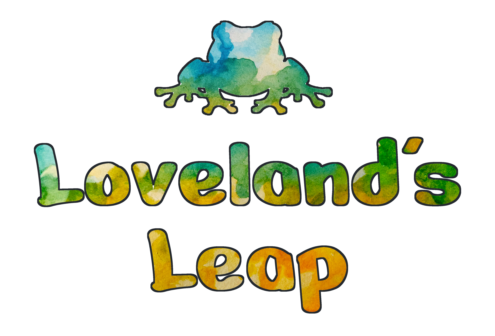

# 

[//]: # (Relink image to Steam page)

[//]: # (TODO: Add Shields badges to Steam, Itch, Trailer)

Loveland is a short platformer video game inspired by the folktales of the Loveland Frog, a cryptid from Ohio. This passion project was produced over a single summer by a small team using [Godot Engine](https://godotengine.org). We invite you to play for free on [Steam](TODO) or [Itch](TODO), as well as learn from, explore, and even modify our open source code.

## About

Loveland was originally produced for [Godot Wild Jam #70](https://itch.io/jam/godot-wild-jam-70). After that initial (very broken) release, we continued working until it was ready to share with the world. This was a big milestone for our team, being our first game to come fully to fruition.

## Installation and Usage

To run the game locally, you will need to install Godot and clone this project.

> [!IMPORTANT]
> This project uses [Godot Engine 4.2 (.NET build)](https://godotengine.org/download/archive/4.2-stable/) and has not been tested on other versions of Godot.

1. Install [Godot 4.2 .NET](https://godotengine.org/download/archive/4.2-stable/).
2. If you do not have any familiarity with Godot, consider reading the [Documentation Introduction](https://docs.godotengine.org/en/stable/about/introduction.html) and [Engine Introduction](https://docs.godotengine.org/en/stable/getting_started/introduction/introduction_to_godot.html) to get familiar with the program.
3. Clone this repository.
4. Run Godot Engine and import this repository.
5. Hit the `Run Project` button to start the game.

## Contributing

We currently welcome contributions in the forms of:

- [Bug reports](https://github.com/JuniperP/Loveland/issues)
- Bug fixes via [pull requests](https://github.com/JuniperP/Loveland/pulls)

> [!NOTE]
> There are no current plans for additional in-game content, but we would love to see any content you make!

## License

Loveland Assets refers to all intellectual property in this repository, excluding Loveland Code.  
Loveland Code refers to all source code, Godot files, and related documentation within this repository.

Loveland Assets © 2024 by Alcove Devs is licensed under [CC BY-NC-SA 4.0](https://creativecommons.org/licenses/by-nc-sa/4.0/).  
Loveland Code © 2024 by Alcove Devs is licensed under [GNU GPLv3](https://www.gnu.org/licenses/gpl-3.0.en.html).

## Credits

Loveland is created and developed by Alcove Devs.

### Programming & Godot Engineers

Juniper Pasternak  
Teddy Jacobson  

### Level Design

Juniper Pasternak  
Teddy Jacobson  

### Music

Elliot Newhouse  
Max Tozer  
Phoebe Tozer  
trouby, "frogs at summer night" effect from FreeSound.  https://freesound.org/s/379828/  

### Background Art

Phoebe Tozer  

### UI Art

Phoebe Tozer  
Teddy Jacobson  
One image designed by Freepik (www.freepik.com)  

### Sprite Creation

Lee Zwart  
Phoebe Tozer  

### Story/Script

Alex Lloyd  
Juniper Pasternak  
Lee Zwart  
Phoebe Tozer  
Teddy Jacobson  

### Sound Effect Editors

Juniper Pasternak  
Phoebe Tozer  

### Sound Effect Creators

Alex Lloyd  
Amanda Tozer  
Anja Jacobson  
Joe Tozer  
Max Tozer  
Teddy Jacobson  

### Concept Design

Alex Lloyd  
Clara Siefke  
Juniper Pasternak  
Lee Zwart  
Phoebe Tozer  
Teddy Jacobson  

### Funding

Eric Jacobson  

### Other

A special thanks to the [Godot Wild Jam](https://godotwildjam.com/)!

And thank you for playing!

